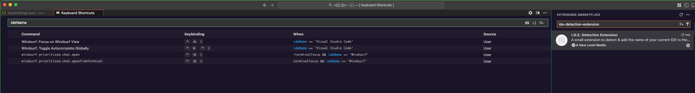
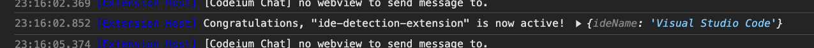

# I.D.E. Detection Extension

What does "I.D.E." stand for you say? Well, it's I.D.E. Detection Extension. ;-)

This is a small extension that detetcts & adds your current IDE's name into the global VSCode context. 

It was mainly developed to be used within `when` contexts in your `keybindings.json` file. 

## How To Use 

After you've installed the extension from the [marketplace](https://marketplace.visualstudio.com/items?itemName=ANewLevelMedia.ide-detection-extension), simply add a `when` condition like this one: 

`````json
{
  "key": "< some keybinding >",
  "command": "< any command from any extension, or even built-in >",
  "when": "ideName == 'Visual Studio Code'"
}
`````

### Example 



## Things to Pay Attention To 

### VS Code Forks 

If you're using another VSCode forked IDE (*i.e. Cursor or Windsurf*), you can check what the `ideName` value will be by opening the dev tools after you startup your IDE. 



### Suggestion Popup 

If you try to search for `ideName` using the completion, suggestion pop-up menu (*usually triggered by pressing `ctrl+space`*), it likely won't show up. 

However, the property should still be available for your `when` clauses. 

